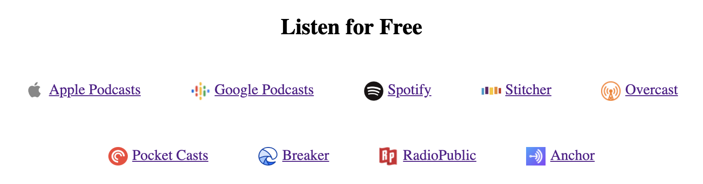

# `dh-components`

This repo serves as a collection of web components used on the [`detachedHEAD` blog](https://detachedhead.net/).

## `<dh-podcast-links>`



This component hosts all of the active links to where you can listen to the detachedHEAD Podcast.

Usage:

```html
<script src="./dh-podcast-links.js"></script>

...

<dh-podcast-links></dh-podcast-links>
```

As shown above, the styling applied is minimal. There is no ShadowDOM applied for the intention to have it match the styles of the host website. 

Additionally you can add a callback function for when the user clicks on one of the links (for the potential use of metric tracking).

```html
<script>
  function someoneClickedOnOfTheLinks (company, data, event) {
    // INCOMING DATA IS OF THE FORM:
    // company --- "Spotify"
    // data    --- {url: "https://open.spotify…", icon: "./asset…"} 
    // event   --- MouseEvent {isTrusted: true, screenX: 486, …}
  }
</script>

<dh-podcast-links on-link-click="someoneClickedOnOfTheLinks"></dh-podcast-links>
```